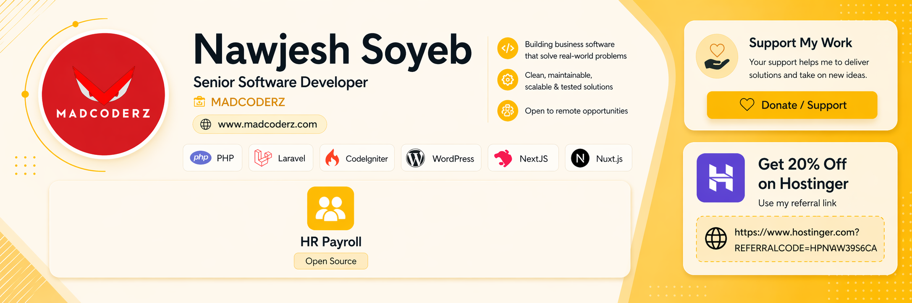

# HR Payroll

Zerithonlabs - Modern HRM + Payroll platform rebuilt with Laravel for real company workflows and long-term maintainability.

> Legacy version note: this `main` branch is the Laravel rebuild. Older legacy implementation may exist in a separate branch.

<p align="center">
  
</p>

<h3 align="center">💛 Support My Work</h3>

<p align="center">
  Your support helps me continue building better software, maintaining open-source projects, and creating useful tools through MADCODERZ.
</p>

<p align="center">
  <a href="https://nawjesh.lemonsqueezy.com/checkout/buy/c5c03632-dcb2-472f-a8cd-4df279c391d8" target="_blank">
    
  </a>
  &nbsp;
  <a href="https://www.hostinger.com?REFERRALCODE=HHPNAWJES5CA" target="_blank">
    
  </a>
</p>

## Why This Project

A complete HRM and Payroll platform for organizations that need one system to manage employee lifecycle, attendance, leave, payroll, approvals, and reporting.

It is designed with a modular Laravel architecture so teams can run day-to-day HR operations with cleaner structure, maintainability, and long-term scalability.

## Main Features

- Employee management
- Attendance management with reports
- Employee clock attendance
- Manage time change requests
- Leave management with reports
- Create leave categories
- Set leave quota
- Approve / reject leave applications
- Payroll management with reports
- Monthly salary template creation
- Bonus management
- Loan management
- Deduction management
- Provident fund management
- Holiday management
- Department management
- Designation management
- Employee role management
- Training and award management
- Notice board and announcement management
- Team management
- Task management
- Private notes
- Team member details view
- Beautiful file preview and comments
- Estimate, invoice, and billing system
- Expense management with reports
- Expense payment reports
- Report printing and export
- Employee notifications
- Custom permissions for team members
- Informative dashboard
- Easy-to-use interface
- Responsive design

## Screenshots

### 1. Settings Page


### 2. Update Profile


### 3. Holiday Calendar


### 4. Attendance & API Integration


## Tech Stack

- PHP 8.2+
- Laravel 12
- MySQL
- Blade templates
- Bootstrap-based admin UI
- Vite

## Quick Start

1. Clone and enter the project

```bash
git clone https://github.com/Devnawjesh/hr-payroll.git
cd hr-payroll
```

2. Install dependencies

```bash
composer install
npm install
```

3. Configure environment

```bash
cp .env.example .env
php artisan key:generate
```

4. Set DB credentials in `.env`, then run:

```bash
php artisan migrate
php artisan db:seed
```

5. Run app

```bash
php artisan serve
npm run dev
```

## Default Seeded Admin

- Email: `admin@hr-payroll.local`
- Password: `P@ssw0rd`

## Access Model (Current)

- `super-admin`: full access
- `hr-manager`: HR operational access
- `department-head`: limited operational access + self-service
- `employee`: self-service access

Employee management menus are restricted for non-HR roles.  
Self-service profile update remains available via topbar dropdown when user is linked to an employee profile.

## SMTP and Outbound Email

SMTP values are configured from the **Settings** page and stored in DB-backed system settings.

Current implemented email flow:

- when HR/Super Admin creates a user, credentials can be emailed
- sender config is loaded from system settings (mailer/host/port/username/password/from)

## Project Structure (High Level)

- `app/Modules/Employees` employee domain
- `app/Modules/Users` user, role, permission domain
- `app/Modules/Settings` system and SMTP settings
- `resources/views/hr` backend UI
- `database/seeders` initial roles, permissions, settings, admin user

## Contributing

Contributions are welcome.

1. Fork the repository
2. Create a feature branch
3. Commit with clear messages
4. Open a pull request with:
   - problem statement
   - approach
   - screenshots (if UI)
   - migration/seed impact

## Roadmap

- stronger test coverage (feature + service tests)
- audit trail improvements
- notification system enhancements
- API layer for external integrations
- richer reporting and exports

<p align="center">
  
</p>

<h3 align="center">💛 Support My Work</h3>

<p align="center">
  Your support helps me continue building better software, maintaining open-source projects, and creating useful tools through MADCODERZ.
</p>

<p align="center">
  <a href="https://nawjesh.lemonsqueezy.com/checkout/buy/c5c03632-dcb2-472f-a8cd-4df279c391d8" target="_blank">
    
  </a>
  &nbsp;
  <a href="https://www.hostinger.com?REFERRALCODE=HHPNAWJES5CA" target="_blank">
    
  </a>
</p>

## License

MIT
